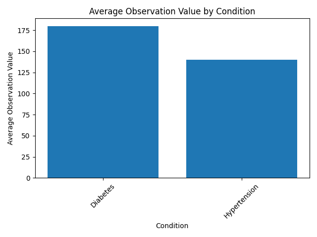

# Clinical Data Analytics Pipeline

An end-to-end healthcare data analytics project built using Python, focusing on transforming raw clinical data into structured insights through data cleaning, feature engineering, and visualization.
## Objectives

- Clean and preprocess raw clinical data to ensure consistency and reliability  
- Transform date fields into usable formats for analysis  
- Create new features such as patient age and encounter time components  
- Perform aggregations to analyze condition-level and time-based trends  
- Generate visualizations to communicate insights effectively  
- Build a structured and reusable data pipeline for healthcare analytics  
## Business Problem

Healthcare organizations generate large volumes of clinical data, but much of it remains underutilized due to inconsistent formatting, missing values, and lack of structured analysis.

In this project, the challenge is to transform raw clinical data into a clean and structured format that enables meaningful analysis of patient conditions and trends over time.

Stakeholders such as healthcare analysts and decision-makers require clear, reliable insights to support better clinical and operational decisions.
## Objectives

* Clean and preprocess raw clinical data to ensure consistency and reliability
* Transform date fields into usable formats for analysis
* Create new features such as patient age and encounter time components
* Perform aggregations to analyze condition-level and time-based trends
* Generate visualizations to communicate insights effectively
* Build a structured and reusable data pipeline for healthcare analytics
## Dataset Description

The dataset consists of clinical healthcare records containing patient demographics, encounter details, and observation values.

Key fields include:

* `birth_date` – Patient date of birth
* `encounter_date` – Date of clinical encounter
* `condition` – Medical condition associated with the patient
* `obs_value` – Observational measurement recorded during encounters

The dataset required preprocessing due to missing values, inconsistent formats, and the need for feature extraction.
## Tools & Technologies

* Python
* Pandas
* Matplotlib
* Visual Studio Code
## Data Cleaning & Preparation

* Standardized column names for consistency
* Removed duplicate records to ensure data integrity
* Converted `birth_date` and `encounter_date` to datetime format
* Handled missing values by removing records with missing `encounter_date`
* Validated numerical fields such as `obs_value` for missing, zero, and negative values
## Feature Engineering

* Created `age` feature using patient birth date
* Categorized patients into `age_group` segments
* Extracted `encounter_year`, `encounter_month`, and `encounter_day` from encounter date
* Generated structured time-based features to support trend analysis
## Exploratory Data Analysis (EDA)

* Analyzed distribution of observation values across different medical conditions
* Created `condition_summary` dataset to compute average observation values by condition
* Generated `monthly_trend` dataset to analyze trends over time
* Identified patterns and variations in clinical observations across conditions and time periods
## Visualizations

### Condition-wise Observation Comparison


### Monthly Trend Analysis

## Key Insights

* Patients with diabetes show higher average observation values compared to those with hypertension
* Observation values exhibit a consistent trend over time, indicating stable measurement patterns
* Aggregated datasets simplify complex clinical data, making it easier to interpret and analyze
* Feature engineering enables deeper analysis of patient demographics and time-based trends
## Outputs

The following outputs were generated during the project:

* `cleaned_data.csv` – Processed and cleaned dataset
* `condition_summary.csv` – Aggregated data by medical condition
* `monthly_trend.csv` – Time-based trend analysis
* `final_dataset.csv` – Final enriched dataset with engineered features
* Visualizations (PNG) – Charts for condition comparison and monthly trends

## Project Structure

CLINICAL_MODELING/
├── data/
│   ├── raw/
│   ├── processed/
│   └── visuals/
├── notebooks/
│   └── data_transformation.py
└── README.md
## How to Run This Project

1. Clone the repository:

   ```bash
   git clone https://github.com/Babaraslamraja/clinical-data-analytics-pipeline
   ```

2. Navigate to the project folder:

   ```bash
   cd CLINICAL_MODELING
   ```

3. Install required libraries:

   ```bash
   pip install pandas matplotlib
   ```

4. Run the data transformation script:

   ```bash
   python notebooks/data_transformation.py
   ```

5. Outputs will be generated in the `data/processed` and `data/visuals` folders
## Future Improvements

* Integrate interactive dashboards using tools like Power BI or Tableau
* Apply advanced analytics or machine learning for predictive insights
* Expand dataset to include more clinical variables and patient history
* Automate the data pipeline for real-time data processing

## Author

**Dr Babar Aslam**  
Data Analyst | Healthcare Analytics | Python  

🔗 LinkedIn: https://www.linkedin.com/in/babar-aslam-4b5b38392
